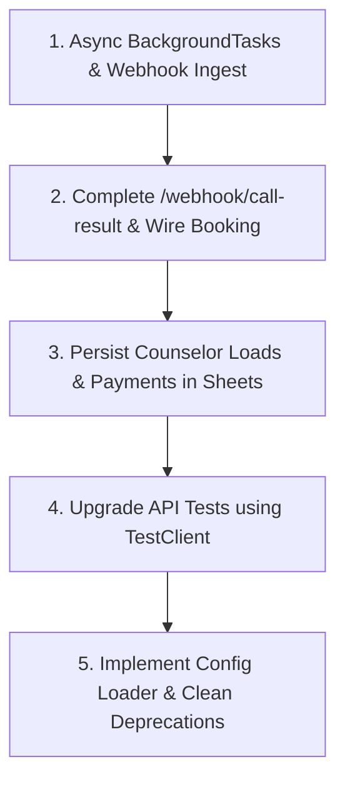

# LeadFlow — Codebase Audit & Status Report

**Audit Date:** June 23, 2026  
**Auditor:** Senior Software Engineer & Project Architect  

This document presents a comprehensive audit of the **LeadFlow** codebase. The evaluation focuses on identifying architectural gaps, functional missing links, testing issues, technical debt, and evaluating agentic readiness to prepare the system for a production-ready transition.

---

## 1. Structural Integrity & Modularity

The directory layout aligns well with the architecture defined in [CLAUDE.md](file:///Users/rudra/Documents/leadflow/CLAUDE.md). However, several architectural boundary violations, interface bypasses, and inconsistencies exist:

### 1.1 Inconsistent Interface Location
- **Violation:** [CLAUDE.md:L12-13](file:///Users/rudra/Documents/leadflow/CLAUDE.md#L12-L13) states: *"Every single external service must hide behind an abstract class interface inside `app/adapters/base.py`."*
- **Deviation:** The `SheetStore` interface is defined inside [app/adapters/sheets.py:L19-35](file:///Users/rudra/Documents/leadflow/app/adapters/sheets.py#L19-L35) rather than `base.py`. This forces pipeline code (e.g., `ingest.py`, `outreach.py`, `scoring.py`, `booking.py`) to import directly from a database adapter module rather than the central base interfaces module, weakening modularity.

### 1.2 Bypassed Interfaces & Missing Real Stubs
- **Violation:** [CLAUDE.md:L17-19](file:///Users/rudra/Documents/leadflow/CLAUDE.md#L17-L19) states that for every integration, a real stub implementation containing third-party packages must be provided, which raises `NotImplementedError`.
- **Deviation:** The [app/adapters/whatsapp.py](file:///Users/rudra/Documents/leadflow/app/adapters/whatsapp.py) module contains **no real implementation stubs** for SendGrid/SMTP or WhatsApp Business API. Only `MockEmail` and `MockWhatsApp` are defined. There is no stub interface detailing where and how to integrate real messaging packages.

### 1.3 Lack of Dependency Injection / Configuration Wiring
- **Violation:** Singletons are instantiated directly at the top level of [app/main.py:L28-29](file:///Users/rudra/Documents/leadflow/app/main.py#L28-L29):
  ```python
  store = InMemorySheet()
  dialer, email, whatsapp = MockDialer(simulate_delay=False), MockEmail(), MockWhatsApp()
  ```
- **Deviation:** There is no configuration-driven dependency injection or adapter registration mechanism. Swapping from mocks to live integrations requires manual modifications to the code in `app/main.py`, bypassing the modular intent.

### 1.4 Counselor Roster Split Source of Truth
- **Violation:** The `Counselors` sheet tab is defined as the system of record.
- **Deviation:** Counselor details are hardcoded as a static array `COUNSELORS` in [scripts/run_demo.py:L28-37](file:///Users/rudra/Documents/leadflow/scripts/run_demo.py#L28-L37). The `SheetStore` interface provides no methods to fetch counselor data, meaning the CRM source of truth is bypassed, and the application has no way to dynamically read counselor availability or load.

### 1.5 Webhook URL Duplication
- **Deviation:** The webhook endpoints are hardcoded in both [apps_script/trigger.gs:L14](file:///Users/rudra/Documents/leadflow/apps_script/trigger.gs#L14) (`https://your-backend.example.com/webhook/new-lead`) and [bolna_agent/agent_config.json:L32](file:///Users/rudra/Documents/leadflow/bolna_agent/agent_config.json#L32) (`https://your-backend.example.com/webhook/call-result`). These should be configurable parameters or loaded via environment variables rather than hardcoded URLs.

---

## 2. Functional Completeness

An analysis of the core features vs. the actual code reveals that while the pipeline runs in the demo script, the web engine is largely non-functional for a live asynchronous setup:

### 2.1 Production-Ready Features
- **Validation & Ingestion (`app/pipeline/ingest.py`):** Schema validation, phone cleaning, and quarantining to `Needs Review` is complete and robust.
- **Lead Scoring (`app/pipeline/scoring.py`):** The priority rule-based scoring (0-100) works as specified in the PRD.

### 2.2 In-Progress Features
- **Outbound Outreach (`app/pipeline/outreach.py`):** Written and functional with mocks. However, the operations run **synchronously**. The dialer call blocks execution (`dialer.call(lead.phone, ...)`), delaying webhook resolution by several seconds.
- **Counselor Booking (`app/pipeline/booking.py`):** The matching algorithm (load balancing + language fallback) is implemented, but it is **never called in the FastAPI server flow** in [app/main.py](file:///Users/rudra/Documents/leadflow/app/main.py). It is only invoked within the mock demo runner [scripts/run_demo.py:L57](file:///Users/rudra/Documents/leadflow/scripts/run_demo.py#L57).

### 2.3 Stubs and Unimplemented Features
- **Missing `/webhook/call-result` Endpoint:** Bolna is configured to callback to the backend at `/webhook/call-result` once a call is completed. However, there is **no endpoint handler** in [app/main.py](file:///Users/rudra/Documents/leadflow/app/main.py) for `/webhook/call-result`. Currently, `run_outreach` blocks on a simulated call, bypassing the asynchronous webhook architecture completely.
- **Transient Payment Idempotency:** Payment idempotency uses an in-memory set `_processed_payments` in [app/pipeline/conversion.py:L13](file:///Users/rudra/Documents/leadflow/app/pipeline/conversion.py#L13). If the web engine restarts, this set is cleared. This is a critical production risk where duplicate payments can easily re-trigger conversion.
- **No Background Processing:** Despite [CLAUDE.md:L9](file:///Users/rudra/Documents/leadflow/CLAUDE.md#L9) stating that LeadFlow relies on Python's built-in `BackgroundTasks` for concurrent processing, there is no usage of `BackgroundTasks` in `app/main.py`. Everything runs sequentially in the request thread.

---

## 3. Testing Health

Running `pytest` passes, but the test suite has substantial coverage gaps and validation bypasses:

### 3.1 Bypassed API Routing & Payload Tests
- **Deviation:** In [tests/test_webhooks.py](file:///Users/rudra/Documents/leadflow/tests/test_webhooks.py), the tests directly call `new_lead()` and `payment()` as standard python functions:
  ```python
  created = new_lead(_good_lead())
  ```
- **Risk:** This completely bypasses the FastAPI HTTP routing, request parsing, response model serialization, and Pydantic validation boundaries. If the HTTP request body structure changes or validation fails in Pydantic, the tests will not catch it.

### 3.2 Testing Blind Spots
- **No tests for `outreach.py`:** The outreach orchestrator (managing call results, messaging attempts, and logging) is completely untested.
- **No tests for `booking.py`:** The language-based assignment and load balancing logic has zero unit test coverage.
- **No integration tests:** There are no tests verifying the end-to-end webhook flow using `fastapi.testclient.TestClient`.

---

## 4. Technical Debt & Housekeeping

### 4.1 Python 3.12+ Deprecated Standard Calls
- **Issue:** The codebase relies heavily on `datetime.datetime.utcnow()` in:
  - [app/models.py:L60-61](file:///Users/rudra/Documents/leadflow/app/models.py#L60-L61)
  - [app/adapters/sheets.py:L47, L80](file:///Users/rudra/Documents/leadflow/app/adapters/sheets.py#L47)
  - [app/utils/logging.py:L8](file:///Users/rudra/Documents/leadflow/app/utils/logging.py#L8)
- **Impact:** In Python 3.12+, `utcnow()` is deprecated and generates verbose warning logs. It should be replaced with timezone-aware datetime calls like `datetime.now(timezone.utc)`.

### 4.2 Unused Configuration Infrastructure
- **Issue:** [config/config.example.yaml](file:///Users/rudra/Documents/leadflow/config/config.example.yaml) defines configuration settings for adapter selection, yet the Python application contains no code to read, parse, or act on this configuration. The singletons remain hardcoded.

### 4.3 Missing `.env` Integration Blueprint
- **Issue:** While `.env.example` lists structure, the application doesn't read environment variables for runtime configuration in the main service layer (e.g., via `os.environ` or `pydantic-settings`).

---

## 5. Agentic Readiness

The codebase is highly structural, which is excellent for agentic navigation. However, some elements restrict direct autonomous work:

- **Macros vs. Skills Confusion:** The `.claude/skills/` directory contains standard developer skill sheets (like `adapter-discipline` and `test-discipline`) mixed with automation scripts that run CLI commands (like `mock-lead-webhook/SKILL.md` containing curl commands). Combining these in the same structure may confuse agents on whether to read it as standard operating rules or execute it as a script.
- **Incomplete Adapter Wire-Up Documentation:** The stubs (like `GoogleSheet`) contain basic `raise NotImplementedError` but do not include comments specifying where configuration keys (e.g. `GOOGLE_APPLICATION_CREDENTIALS` or spreadsheet ID) should be passed in by the constructor caller.
- **No API Contract:** There is no OpenAPI spec schema documented in `docs/` that an agent can analyze to generate integration scripts without inspecting Python files.

---

## 6. Prioritized Action Plan

To move this codebase to a robust, production-ready state, we recommend executing the following five tasks in order:



### Task 1: Fix Webhook Async Latency (FastAPI BackgroundTasks)
- **Goal:** Prevent API requests from blocking on external voice calls.
- **Implementation:**
  - Update `POST /webhook/new-lead` to accept the payload, validate it, append it to sheets as a `NEW` lead, and then enqueue the outreach flow (`run_outreach` and subsequent scoring) using FastAPI's `BackgroundTasks`.
  - Return a `202 Accepted` immediately.

### Task 2: Implement `/webhook/call-result` Endpoint & Wire Counselor Booking
- **Goal:** Enable the asynchronous screening outcome flow.
- **Implementation:**
  - Add the missing `POST /webhook/call-result` endpoint to [app/main.py](file:///Users/rudra/Documents/leadflow/app/main.py) to capture the Bolna callback.
  - Make `run_outreach` trigger the call asynchronously and return.
  - When `/webhook/call-result` receives the webhook, update the lead's notes, score, and call the counselor assignment algorithm (`booking.py`).

### Task 3: Persist Counselor Data and Payments in Sheets
- **Goal:** Remove transient in-memory states.
- **Implementation:**
  - Add `get_counselors` and `update_counselor` methods to the `SheetStore` interface and implement them in `InMemorySheet` and `GoogleSheet`.
  - Fetch counselor roster availability and current loads directly from the Sheet.
  - Move `_processed_payments` from in-memory set to a new sheet tab `Payments` (or log inside `Events` and read from there) to ensure payment idempotency survives process restarts.

### Task 4: Upgrade API Testing with `TestClient`
- **Goal:** Secure the API interface boundaries.
- **Implementation:**
  - Refactor `tests/test_webhooks.py` to use `fastapi.testclient.TestClient`.
  - Write test cases checking that the correct Pydantic validation errors are thrown for bad payloads, that routing works, and that HTTP status codes are correct (e.g. `202 Accepted` on ingest).
  - Add unit tests for `booking.py` load balance logic and `outreach.py` task sequencing.

### Task 5: Implement YAML Config Loader & Clean Deprecations
- **Goal:** Modernize infrastructure loading and fix deprecation warnings.
- **Implementation:**
  - Create a settings reader using `pydantic-settings` or a yaml parser to initialize adapters based on environment variables and `config.yaml`.
  - Replace all occurrences of `datetime.utcnow()` with `datetime.now(timezone.utc)` (importing `timezone` from `datetime`) to remove all 23 deprecation warnings.
